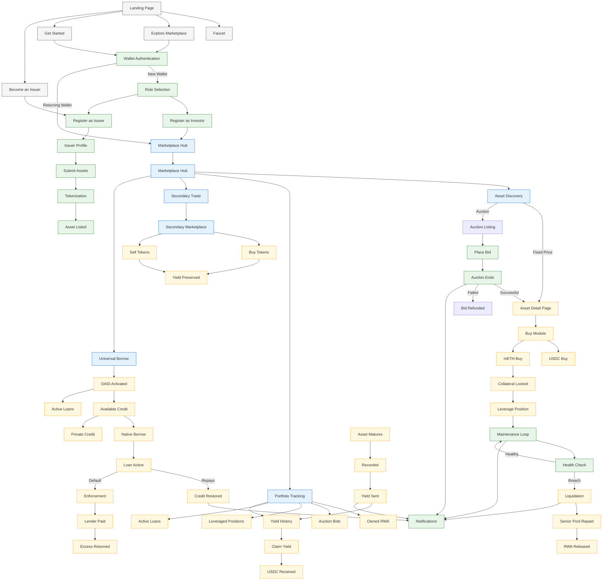

``` text
________                                  _____                         __            
\_____  \ ______   ____   ____           /  _  \   ______ ______  _____/  |_  ______  
 /   |   \\____ \_/ __ \ /    \         /  /_\  \ /  ___//  ___/_/ __ \\   __\/  ___/  
/    |    \  |_| \ ___/|   |  \       /    |    \\___ \ \___ \ \  ___/|  |  \___ \   
\_______  /   __/ \___  ____|  /       \____|__  /____  _____  _ \___  ___| /____ \  
        \/|__|        \/     \/                \/     \/     \/      \/          \/

```

<h2 align="center">
T O K E N I Z E   •   I N V E S T   •   T R A D E   •   B O R R O W   •   E A R N
</h2>
<h3 align="center" style="letter-spacing:2px;"><em>ALL IN ONE UNIFIED EXECUTION LAYER</em></h3>


**The premier Mantle-native gateway for Real-World Assets. Tokenize and invest in RWA invoices, leverage mETH for capital-efficient purchases, access universal credit via OAID, compose RWA into usable credit, trade freely in real value.**

---

<div align="center">

[](https://www.openassets.xyz)
[](https://open-assets-core-proposal.notion.site/Open-Assets-Mantle-Network-2d5316cd01a780818164c5889beb1a19)
[](https://x.com/TheOpenAssets)
[](https://discord.gg/hKp6RTSp59)
[](https://t.me/the_open_assets)

</div>

---


---

<div align="center">
  <br />
 
  <h1>Bridging the RWA Liquidity Gap</h1>
  <p><em>From static records to dynamic, credit-enabled financial primitives.</em></p>
</div>

---

## The Problem: Structural Inefficiencies in RWA

The first generation of tokenized Real-World Assets (RWAs) successfully moved ownership to the blockchain but failed to solve the **utility** and **fairness** challenges of high-frequency finance.

### 1 **Opaque & Fragmented Discovery**
Traditional RWA sales happen behind closed doors or via static listings. This leads to **fragmented liquidity** and **unfair pricing**, where retail participants have zero visibility into the true market demand for an asset.

### 2 **The "<em>Static Asset</em>" Paradox**
Currently, when a user buys a tokenized invoice, their capital is effectively "frozen" until maturity. The asset remains a dead weight in the wallet, unable to be used as collateral or leveraged without moving it to a specific, siloed lending protocol.

### 3 **Yield Sniping & Inequity**
Most on-chain yield models favor the **last holder**. If an investor holds an asset for 90% of its duration but sells just before settlement, they often lose 100% of the accrued yield to the buyer. This discourages secondary market liquidity and penalizes long-term holders.

---

## 💡 The Solution: The OpenAssets Unified Execution Layer

OpenAssets provides a deterministic lifecycle for RWAs on Mantle, ensuring every step—from issuance to settlement—is optimized for capital efficiency.

###  **1 Canonical Tokenization**
> **Standardization at the Core**
> 
> We transform off-chain cash flows into **ERC-3643 compliant** tokens. Every asset follows a strict, non-reversible state machine on Mantle, ensuring institutional-grade auditability from the moment of issuance.

###  **2 Hybrid Market Discovery**
> **Flexible Capital Formation**
> 
> Originators can choose the best pricing strategy for their asset:
> * **Fixed-Price Listings:** Instant liquidity for standard, high-velocity invoices.
> * **Uniform-Price Auctions:** Fair price discovery for unique or large-cohort assets, ensuring all investors pay the same clearing price.


###  **3 mETH-Powered Leverage**
> **Self-Amortizing Acquisition**
> 
> Leveraging Mantle’s native **mETH**, users can acquire RWAs with high capital efficiency. The **native staking yield of mETH** is automatically harvested to service loan interest, allowing users to hold leveraged RWA positions with near zero out-of-pocket interest costs and at times earning even more.


###  **4 OAID & Universal Credit**
> **Deposit Once, Borrow Everywhere**
> 
> Your **Open Access ID (OAID)** acts as a universal credit identity. By decoupling collateral custody (Solvency Vault) from credit issuance, users can tap into multiple Mantle lending protocols and more using a single RWA collateral pool. No more moving assets, just portable, verifiable credit.


### **5 Time-Weighted Yield (Token-Days)**
> **Eliminating Yield Sniping**
> 
> Our **Token-Day Engine** calculates yield entitlement down to the second. By tracking the duration of ownership, we ensure yield is distributed fairly between all past and present holders. This mathematically guarantees returns for your exact period of risk.


---
### **Data Management**

---

<div align="center">
  <samp>Issuance • Discovery • Leverage • Credit • Settlement</samp>
</div>

---
<div align="center">
  <samp>Built for the Mantle Network</samp>
</div>

### Interactive Flow Map
 **Note:** For a high-resolution, interactive version of this diagram with details for specific modules, please visit our </br> 
 [Official User Flow Documentation Page](https://www.openassets.xyz/how-it-works). 
 </br>
 (<em>Please open the system sitemap on the platform on the apex section.</em>)



---

<div align="center">
  <br />
  <sub><strong>TECHNICAL WALKTHROUGH</strong></sub>
  <h1>Understand OpenAssets in Minutes</h1>
  <p><em>Guided demonstrations of our Mantle-native execution layer and RWA lifecycle.</em></p>
</div>

---

## The Infrastructure Layer

The OpenAssets Client is a **High-Fidelity State Interpreter**. It coordinates seamlessly with our Mantle-native smart contracts and a dedicated backend indexing layer to provide institutional-grade performance.

* **Real-Time Sync:** Uses Redis-backed WebSockets to push live bid updates and health factor changes.
* **Trustless Data:** Critical financial metrics (LTV, Debt, Yield) are read directly from Mantle Sepolia.
* **Role-Based UX:** Optimized interfaces for both **Issuers** (Asset Tokenization) and **Investors** (Discovery & Credit).

---

## Feature Demos & Walkthroughs

We have curated a library of short, guided videos to demonstrate the core functionality of the protocol. 

You can find all the walkthroughs on our website at once interactive section here > [Walkthroughs](https://www.openassets.xyz/how-it-works)

### 1 Onboarding & Discovery
| Module | Description | Watch Demo |
| :--- | :--- | :--- |
| **Authenticate** | Wallet-bound authentication and role-based onboarding. | [▶ View](https://www.youtube.com/watch?v=NzwJmR2Cf-c) |
| **Asset Registration** | Issuer flow for submitting and tokenizing real-world assets. | [▶  View](https://www.youtube.com/watch?v=NvWckbwETag) |
| **Marketplace** | Browsing RWA listings with transparent yield and risk metrics. | [▶ View](https://www.youtube.com/watch?v=ZIQv8VWyGm0) |

### 2 Acquisition & Trading
| Module | Description | Watch Demo |
| :--- | :--- | :--- |
| **USDC Buy** | Direct purchase of tokenized RWA invoices. | [▶  View](https://www.youtube.com/watch?v=83KqrM6dhFs) |
| **Auction Bidding** | Participating in Uniform-Price Auctions for fair discovery. | [▶ View](https://www.youtube.com/watch?v=IB1VmpVxiXQ) |
| **Secondary Trade** | P2P trading while preserving time-weighted yield accrual. | [▶ View](https://youtu.be/f4UW6pApmhI) |

### 3 Mantle-Native Innovation (Leverage & Credit)
| Module | Description | Watch Demo |
| :--- | :--- | :--- |
| **mETH Leverage** | Using mETH yield to service RWA acquisition interest. | [▶ View](https://youtu.be/c7CdBkcVZPQ) |
| **Credit Line** | Activating OAID to create credit lines against RWA collateral. | [▶ View](https://youtu.be/aFx4cktm_ss) |
| **Borrowing** | Drawing liquidity across native and partner protocols. | [▶ View](https://youtu.be/QY0fwxX2mTM) |
| **Repayment** | Restoring credit limits and reclaiming collateral. | [▶ View](https://youtu.be/NIzF8LUORrY) |

---

## Portfolio & Health Monitoring

The **OpenAssets Dashboard** provides a unified view of your entire RWA exposure. Users can track health metrics for leveraged positions in real-time, preventing liquidations through proactive mETH collateral management. Manage entire asset lifecycle, operations and keep a track of all your operations.

* **Health Score:** Real-time LTV monitoring powered by mETH/USDC price feeds.
* **Yield History:** Transparent view of accrued "Token-Day" yield ready for claiming.
* **Portfolio Demo:** [▶ Watch the Overview](https://youtu.be/NtLOZqsX5U8)

---

### Our Journey

---

---
<em>Navigate our jouney through a series of commits, pushes, pr's and a lot of branches</em>
-> [Changelog](https://www.openassets.xyz/changelog)

---

<div align="center">
  <br />
  <sub><strong>DEVELOPER ONBOARDING</strong></sub>
  <h1>Installation & Local Setup</h1>
  <p><em>Step-by-step guide to deploying the OpenAssets interface on your local machine.</em></p>
</div>

---

## Getting Started

### Prerequisites
Before you begin, ensure you have the following installed:
* **Node.js**: v20.x or higher (Recommended: v22 LTS)
* **Package Manager**: `npm` or `pnpm`
* **Web3 Wallet**: MetaMask or any mantle supporting wallet configured for the **Mantle Sepolia Testnet**.
* **Mantle Faucet**: Ensure you have test **MNT** for gas.
* **Open Assets Backend Up**: Ensure you have the server and contracts up. (<em>Steps can be found here [Backend Setup](https://github.com/TheOpenAssets/TOA-Server-Mantle/blob/main/README.md)</em>)


### 1. Clone the Repository
```bash
git clone https://github.com/TheOpenAssets/TOA-Client-Mantle.git
```

### 2. Install Dependencies

We recommend using `npm` for consistent dependency resolution:

```bash
npm install
```

### 3. Environment Configuration

The application requires several contract addresses and API endpoints to function. Create a `.env` file in the root directory:

```bash
cp .env.example .env
```

### 4. Run the Development Server

```bash
npm run dev
```

<em>Navigate to your localhost provider.</em>

---

## Environment Variables (.env)

The interface uses the following variables to interact with the **OpenAssets Protocol Core**. Ensure all contract addresses are correctly mapped to your Mantle Sepolia deployments.

### **Core Infrastructure**

| Variable | Description |
| --- | --- |
| `VITE_API_URL` | Base URL for the Backend API |
| `VITE_WALLETCONNECT_PROJECT_ID` | Your wallet connect project ID for wallet authentication |
| `VITE_FAUCET` | Address of the RWA Test Token Faucet |
| `VITE_USDC_ADDRESS` | Canonical USDC contract on Mantle Sepolia |

### **Marketplace & Yield**

| Variable | Description |
| --- | --- |
| `VITE_PRIMARY_MARKETPLACE_ADDRESS` | Contract for auctions and initial listings |
| `VITE_SECONDARY_MARKET` | Peer-to-peer RWA trading contract |
| `VITE_YIELD_VAULT_ADDRESS` | The time-weighted yield distribution engine |
| `VITE_TOKEN_FACTORY` | Factory for minting ERC-3643 RWA tokens |

### **Identity & Compliance**

| Variable | Description |
| --- | --- |
| `VITE_IDENTITY_REGISTRY` | Source of truth for user KYC/Identity |
| `VITE_TRUSTED_ISSUERS_REGISTRY` | List of approved asset originators |
| `VITE_ATTESTATION_REGISTRY` | Storage for asset-level compliance data |

### **Mantle Innovation (mETH Leverage)**

| Variable | Description |
| --- | --- |
| `VITE_MOCK_METH` | Mantle Staked ETH (mETH) address |
| `VITE_METH_FAUCET` | Faucet for test mETH |
| `VITE_LEVERAGE_VAULT` | mETH-collateralized buy management |
| `VITE_FLUXION_INTEGRATION` | Swap logic for mETH ↔ USDC |
| `VITE_MOCK_FLUXION_DEX` | DEX router for interest servicing |

### **Universal Credit (OAID)**

| Variable | Description |
| --- | --- |
| `VITE_OAID` | Universal credit identity registry |
| `VITE_SOLVENCY_VAULT` | Secure RWA collateral custodian |
| `VITE_SENIOR_POOL` | Primary USDC liquidity lending pool |

---

## Build for Production

To create an optimized production build:

```bash
npm run build
npm run preview
```

---


### OpenAssets Smart Contract Registry (Mantle)

| Contract Name | Address | Description |
| --- | --- | --- |
| **Identity Registry** | `0x2E310C62A225033055E88B690F8d054ece8bcbC4` | Source of truth for ERC-3643 KYC/Identity facts |
| **Token Factory** | `0x7C75795Cf41ee32fB4FEB89964d7591F0a44BcfE` | Core factory for minting compliant RWA tokens |
| **Yield Vault** | `0xa05bDf67483EB6ba5CcA0dc81543DeD5Ed845Da7` | Time-weighted yield distribution engine |
| **Primary Marketplace** | `0x7D8ac3ff7E7fd1a577ff778922Cc568be669beE0` | Handles RWA auctions and fixed-price listings |
| **Secondary Market** | `0x23f5c5893333199B3E166aCB8D48479D5E5B32CA` | Peer-to-peer trading engine for RWA tokens |
| **OAID (Open Access ID)** | `0xcc24b78Fa213304085684833597Fdc6CB5c8DfB0` | Universal on-chain credit identity registry |
| **Solvency Vault** | `0x039cB576d9F7D77d6bE0269E0904B6ceFA845C6B` | Secure RWA collateral custodian |
| **Senior Pool** | `0x9E5F4DD0178C08f27cC5Bd3E0e75Ed339385B346` | Primary USDC liquidity lending pool |
| **Leverage Vault** | `0x5EC05eBFA8AD682d09C8Ef99c1f15844Abe415BF` | mETH-collateralized acquisition manager |
| **Fluxion Integration** | `0xBf74A4CE5B8D1Aad592A3776e10537Ad27dA28Eb` | Swap logic for mETH ↔ USDC interest servicing |
| **Attestation Registry** | `0x03FE7d3736402D140659e7bD92B64808E31C3f51` | Storage for asset-level compliance data |
| **Trusted Issuers** | `0xf63B563b6D438122cBC87f4356e60b8BB3Bc53E2` | Whitelist of approved asset originators |
| **USDC** | `0x9A54Bad93a00Bf1232D4e636f5e53055Dc0b8238` | Canonical settlement stablecoin |
| **USDC Faucet** | `0x26Da2F1a2de3295302Fd95eBA1A183dc8Ffd77a3` | Testnet faucet for RWA settlement asset |
| **Mock mETH** | `0x4Ade8aAa0143526393EcadA836224EF21aBC6ac6` | Mantle Staked ETH (mETH) Mock contract |
| **mETH Faucet** | `0xB50d0AC5D59E456C1f3EdB66403fd27eEbd155dB` | Testnet faucet for leverage collateral |
| **Mock Fluxion DEX** | `0x882eA0d81d445CF9e696869af4D007008281892D` | DEX router for automated price discovery |

---
<div align="center">
  <br />
  <sub><strong>GET IN TOUCH</strong></sub>

  <h1>Contact the Core Team</h1>
  <p><em>Have questions about the implementation or interested in integration? Reach out to us.</em></p>
</div>

<div align='center'>
<a href='https://www.openassets.xyz/about' target='_blank'> About Us </a>
</div>

</br>

<div align="center">
  <br />
  <sub><strong>THE ARCHITECTS</strong></sub>
  <p><em>Engineering the future of RWA liquidity on Mantle.</em></p>


  <a href="https://x.com/18_r_y_u_k_07"></a>
  <a href="https://x.com/Dead_Bytx"></a>
  <a href="https://x.com/Kaushaly4s5s7"></a>

<div>
    <sub> <em>Bob The Builder's</em></sub>
</div>

</div>

---

<div align="center">
  <br />
  
  <br />
  <br />
  <p>
    <strong>© 2026 OpenAssets. All rights reserved.</strong><br />
    Built with precision for the <strong>Mantle Network</strong> ecosystem.
  </p>
  <samp>
    Secure • Liquid • Transparent • Fair
  </samp>
  <br />
  <br />
  <p>
    <sub>Licensed under the MIT License. Developed for the Mantle Hackathon 2026.</sub>
  </p>
</div>

---

